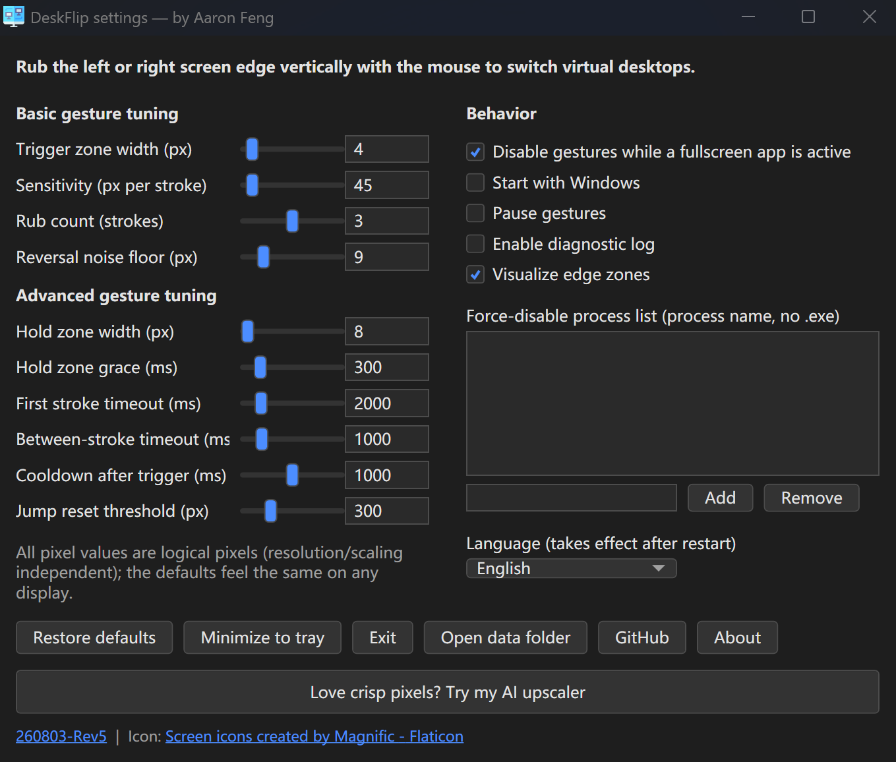

<p align="center">

</p>

<h2 align="center"> DeskFlip </h2>

<h3 align="center"> A mouse gesture tool for Windows 11: rub the screen edges to switch virtual desktops </h3>

<p align="center">
<a href=https://github.com/AaronFeng753/DeskFlip/releases/latest></a>

</p>

#### [📜中文 说明文档](https://github.com/AaronFeng753/DeskFlip/blob/main/README_CN.md)

# [💾Download Latest Release (Windows 11 x64)](https://github.com/AaronFeng753/DeskFlip/releases/latest)

Single portable `DeskFlip.exe`. No installation, no .NET runtime required. Put it anywhere and run it.

Supported Languages: English, 简体中文.

# What is DeskFlip?

### A tiny tray utility for switching Windows 11 virtual desktops with a mouse gesture: rub the left or right screen edge vertically (slide the cursor up and down along the edge) to flip to the previous/next desktop.



### ✨Key features:
- 🖱No buttons, no hotkeys: just rub the screen edge with your mouse.
- 🎯Adjustable sensitivity: trigger-zone width, stroke length, rub count and more.
- 🖥Smart fullscreen detection: gestures are automatically disabled while a fullscreen app is active.
- 🚫Per-app blocklist: never trigger while specific programs are running.
- 🌗Dark-mode settings window that matches the Windows 11 look.
- 🚀Optional auto-start at login.
- 🔋Lightweight: sits quietly in the system tray, near-zero resource usage.

# Why I made this

The only mouse gesture I ever use on a Windows PC is switching virtual desktops. The gesture tool I had been using stopped working on Windows 11, and every open-source alternative I could find had been abandoned years ago. So I wrote my own, and I'm releasing it here, free and open source.

# How to use

- Rub the **left** screen edge vertically (down, then up) → switch to the desktop on the left. The **right** edge works the same way.
- Tip: fling the cursor into the edge so it stops against it, then slide vertically along the edge.
- **Double-click** the tray icon to open Settings; **right-click** it to pause gestures or exit.
- The settings window opens automatically on first run.
- Gestures stop at the leftmost/rightmost desktop (same as the `Win+Ctrl+←/→` hotkeys, no wrap-around).

# Privacy policy🙈🙉🙊

```
1. This software never connects to the internet. There is no server, no telemetry, no update checker.

2. All settings are stored locally at %AppData%\DeskFlip\settings.json.

In conclusion, we don't collect any data from you.
```

# Note on antivirus warnings

DeskFlip observes the cursor position through a global mouse hook and switches desktops by sending the standard `Win+Ctrl+←/→` hotkeys to Windows. Heuristically this resembles what keyloggers and automation tools do, so an unsigned build may trigger Windows SmartScreen or antivirus warnings. This is a false positive; the entire source code is published here for your review.

# [📄License](https://github.com/AaronFeng753/DeskFlip/blob/main/LICENSE)

#### DeskFlip is free and open source, licensed under the [GNU AGPLv3](https://github.com/AaronFeng753/DeskFlip/blob/main/LICENSE).

# 💝Credits💝:
- App icon: [Screen icons created by Magnific - Flaticon](https://www.flaticon.com/free-icons/screen)
